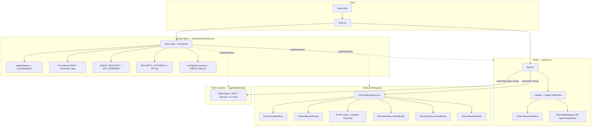
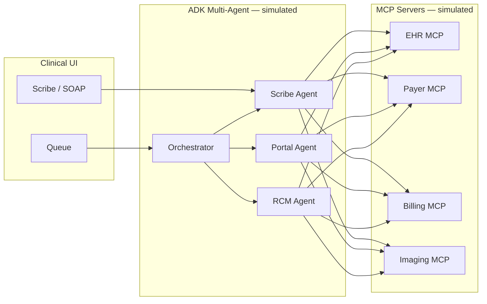
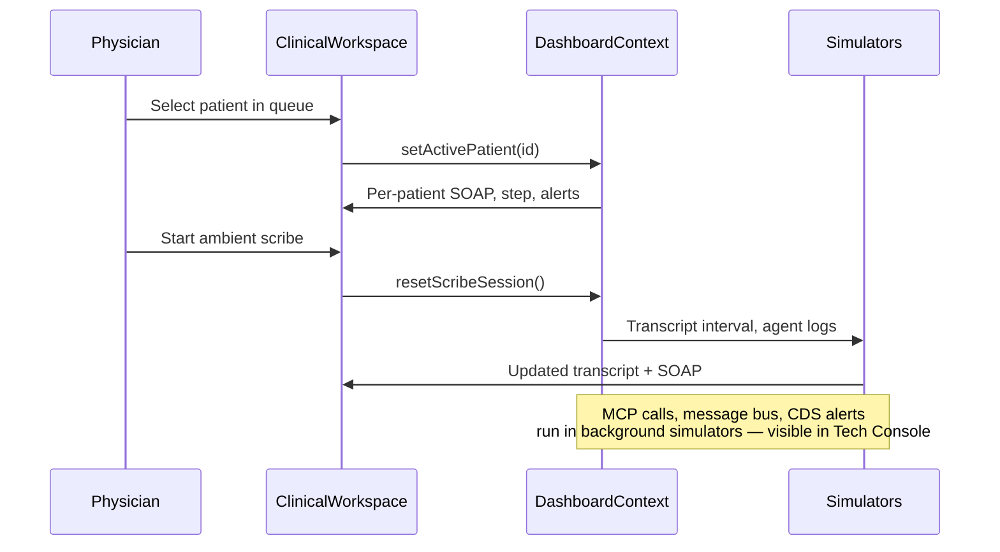

# Sage Clinical Agent 🌿

A neurology-focused clinical automation dashboard that simulates an autonomous healthcare agent for ambient scribing, prior authorization, patient intake, clinical decision support (CDS), and revenue cycle management (RCM) — backed by a demonstrated multi-agent system, MCP server inspector, security controls, and an Agents CLI (the **Agent Studio / ADK** console).

Built as a single-page React application with live mock data streams, designed for high readability in both light and dark modes.

---

## Problem (Neurology Example for Demo)

Outpatient neurology clinics face overlapping burdens that compete for physician attention during patient visits:

| Challenge | Impact |
|-----------|--------|
| **Documentation load** | Physicians spend significant time on SOAP notes instead of direct patient care |
| **Prior authorization friction** | Neuroimaging (MRI/MRA), EEG, EMG/NCS, and specialty therapies require insurer portal navigation and clinical justification |
| **Intake & eligibility** | Staff manually verify coverage, copays, and appointment readiness |
| **CDS monitoring** | EEG, ICP, and seizure-risk signals need context during encounters — not as global dashboard noise |
| **RCM leakage** | Denied claims and missing documentation delay reimbursement |

Traditional agent dashboards expose raw telemetry (JSON state, message buses, global alert walls) that increase cognitive load for practicing clinicians. Sage addresses this by separating the **physician workspace** from **engineering/debug surfaces**.

---

## Solution

**Sage Clinical Agent** uses a **master-detail split layout**:

| Area | Purpose |
|------|---------|
| **Left — Today's Queue** | Persistent day schedule; select any patient; **Verify** only for Pending/Ineligible |
| **Center — Clinical Workspace** | Encounter workflow for the **active patient only**: Intake → Scribe → Prior Auth → Billing |
| **Header — Tech Console** (gear icon) | ADK multi-agent graph, MCP inspector, security posture, Agents CLI — hidden during routine care |

### Clinical workflow (center panel)

1. **Intake** — Eligibility and copay status for the selected patient
2. **Scribe** — Ambient transcript (collapsed by default) + AI-synthesized SOAP note as the visual focus; patient-scoped ICP/Alpha monitor
3. **Prior Auth** — Claims pipeline filtered to the active patient
4. **Billing** — RCM ledger filtered to the active patient

### Tech Console (gear icon → “Back to clinic” to return)

- **Multi-Agent** — Orchestrator + Scribe, Portal, and RCM agents; message bus and task queues
- **MCP Inspector** — EHR, Payer, Billing, and Imaging MCP servers with tool-call traces
- **Security** — RBAC scope, PHI redaction log, credential vault, audit trail
- **Agents CLI** — Named skills (`/agents list`, `/skill run intake.verify PT-03`, etc.)

### Design principles

- Sage & earthy neutral palette (`#f7faf8` linen background, `#647b6a` accents)
- WCAG-friendly contrast; leaf/sprout status iconography
- Neurology CDS (EEG/ICP) scoped to the **active patient**, not pinned globally
- Clinical alerts collapsed into a **patient-scoped badge + drawer**

---

## Architecture

### High-level layout

Sage uses a **full-height master-detail shell** (`h-screen`, fixed queue + scrollable workspace). Physicians stay in **Clinical mode** by default; **Tech Console** is one click away and does not share the queue column.

#### Clinical mode (default)

```
╔══════════════════════════════════════════════════════════════════════════╗
║  🌿 Sage Clinical Agent        Neurology · Dr. Evelyn Young      [⚙]     ║
╠════════════════════╦═════════════════════════════════════════════════════╣
║  TODAY'S QUEUE     ║  ACTIVE ENCOUNTER                                   ║
║  (320px sidebar)   ║  ─────────────────────────────────────────────────  ║
║                    ║  Arthur Pendelton · Chronic Migraine F/U · 09:00    ║
║  ┌────────────────┐║  ┌────────┐ ┌────────┐ ┌────────────┐ ┌────────┐    ║
║  │● Arthur        │║  │ Intake  │ │ Scribe │ │ Prior Auth │ │Billing │   ║
║  │  ✓ Eligible    │║  └────────┘ └────────┘ └────────────┘ └────────┘    ║
║  └────────────────┘║                                                     ║
║  ┌────────────────┐║  ┌─────────────────────────────────────────────┐    ║
║  │  Sarah         │║  │         Clinical SOAP Note (center focus)    │   ║
║  │  ✓ Eligible    │║  │   S · O · A · P  —  AI draft, physician edit │   ║
║  └────────────────┘║  └─────────────────────────────────────────────┘    ║
║  ┌────────────────┐║  ▸ Ambient transcript (collapsed by default)        ║
║  │  Michael       │║  ▸ Patient monitor — ICP / Alpha (this pt only)     ║
║  │  ⏳ Pending     │║                                                    ║
║  │  [Verify]      │║  [ Clinical Alerts ]  ← badge only if pt has alerts ║
║  └────────────────┘║                                                     ║
║  ┌────────────────┐║                                                     ║
║  │  Diana …       │║                                                     ║
║  │  Robert …      │║                                                     ║
║  └────────────────┘║                                                     ║
╚════════════════════╩═════════════════════════════════════════════════════╝
         ▲                              ▲
         │                              │
   activePatientId              EncounterWorkflow step
   (click to switch)           drives center panel content
```

| Zone | Component | Behavior |
|------|-----------|----------|
| **Header** | `Layout.jsx` | Branding, physician context, **gear** opens Tech Console |
| **Left** | `PatientQueueSidebar.jsx` | Full day list; selection highlight; **Verify** only for Pending/Ineligible |
| **Right** | `ClinicalWorkspace.jsx` | Per-patient Intake / Scribe / Prior Auth / Billing; SOAP is the visual anchor |

#### Tech Console mode (gear icon → “Back to clinic”)

```
╔══════════════════════════════════════════════════════════════════════════╗
║  ← Back to clinic                              Tech Console (ADK debug)  ║
╠══════════════════════════════════════════════════════════════════════════╣
║  ┌─────────────┬─────────────┬─────────────┬─────────────┐               ║
║  │ Multi-Agent │ MCP Inspect │  Security   │ Agents CLI  │               ║
║  └─────────────┴─────────────┴─────────────┴─────────────┘               ║
║                                                                          ║
║   Orchestrator graph · message bus · MCP tool traces                     ║
║   RBAC · PHI log · vault · audit trail · /agents list · skills           ║
║                                                                          ║
║   (No patient queue — isolated from clinical UX)                         ║
╚══════════════════════════════════════════════════════════════════════════╝
```

**Routing:** `App.jsx` renders `ClinicalWorkspace` or `AgentStudioView` based on `activeTab` in `DashboardContext` — the clinical layout is never modified when debugging agents.


### Application diagram



### Agent orchestration



### Data flow



### Tech stack

| Layer | Technology |
|-------|------------|
| UI | React 19 |
| Build | Vite 8 |
| Styling | Tailwind CSS v4 (`@theme` in `src/index.css`) |
| Icons | Lucide React |
| State | React Context (`DashboardContext.jsx`) |
| Lint | Oxlint |
| Optional API | FastAPI (`backend/`) — ADK stub, PHI/injection guards |

### Project structure

```
agy-clinical-dashboard/
├── public/
│   └── favicon.svg
├── src/
│   ├── main.jsx
│   ├── App.jsx                         # clinical vs agent-studio router
│   ├── index.css                       # Sage design tokens
│   ├── context/
│   │   └── DashboardContext.jsx        # Mock data, simulators, agent registries
│   ├── api/
│   │   └── agentApi.js                 # Optional backend client (Tech Console only)
│   └── components/
│       ├── Layout.jsx                  # Master-detail shell
│       ├── PatientQueueSidebar.jsx     # Today's Queue (left column)
│       ├── ClinicalWorkspace.jsx       # Active encounter (center)
│       ├── EncounterWorkflow.jsx       # Intake → Scribe → Prior Auth → Billing
│       ├── PatientMonitorPanel.jsx     # Patient-scoped ICP / EEG
│       ├── ClinicalAlertsDrawer.jsx    # Patient-scoped alerts badge
│       ├── PriorAuthView.jsx           # Prior auth (clinical + full modes)
│       ├── RcmCdsView.jsx              # Billing ledger (clinical + full modes)
│       └── AgentStudioView.jsx         # Tech Console shell
│           ├── MultiAgentView.jsx
│           ├── McpInspectorView.jsx
│           ├── SecurityView.jsx
│           └── AgentsCliView.jsx
├── scripts/                            # Optional runtime validation (see docs/)
├── docs/
│   └── AGENT_RUNTIME_TESTING.md
├── backend/                            # Optional FastAPI + ADK scaffold
│   ├── main.py
│   ├── agents/orchestrator/
│   ├── security/
│   └── README.md
├── implementation_plan_neurology.md
└── tasks.md
```

---

## Course concepts demonstrated

This project applies **Google Agent course** key concepts as follows:

| Key Concept | Where | How in Sage |
|-------------|-------|-------------|
| **Agent / Multi-agent (ADK)** | Code | `AGENT_REGISTRY`, `MultiAgentView.jsx`, `backend/agents/orchestrator/` |
| **MCP Server** | Code | `MCP_SERVERS`, `McpInspectorView.jsx`, simulated tool-call trace |
| **Security features** | Code | `SecurityView.jsx`, PHI/injection guards in `backend/security/` |
| **Agent skills (Agents CLI)** | Code | `AgentsCliView.jsx`, `AGENT_SKILLS`, `runAgentCommand()` |
| **Antigravity** | Video | Ambient scribe + background Portal/RCM automation without physician prompting |
| **Deployability** | Video | `npm run build` → Vercel; optional `backend/Dockerfile` → Cloud Run |

**Code review path:** `npm run dev` → Clinical Workspace for the physician demo → **gear icon** (top-right) for Tech Console.

---

## Setup

### Prerequisites

- **Node.js** 18+ (20+ recommended)
- **npm** 9+

No API keys are required for the frontend demo.

### Install and run (frontend — primary)

```bash
git clone <your-repo-url>
cd agy-clinical-dashboard

npm install
npm run dev
```

Open **http://localhost:5173** (or the URL printed in the terminal).

### Other commands

```bash
npm run build    # Production build → dist/
npm run preview  # Preview production build locally
npm run lint     # Run Oxlint
```

### Optional backend scaffold

The backend is **not required** for the clinical demo. To explore server-side PHI guards, injection detection, and CLI mirroring:

```bash
cd backend
python -m venv .venv && source .venv/bin/activate
pip install -r requirements.txt
uvicorn main:app --reload --port 8080
```

To connect **only the Tech Console Agents CLI** to the local API, copy `.env.example` to `.env.local` in the project root:

```env
VITE_AGENT_API_URL=http://localhost:8080
```

Restart `npm run dev`. The clinical workspace is unchanged; only the CLI in Tech Console calls the backend.

See [`backend/README.md`](backend/README.md) and [`docs/AGENT_RUNTIME_TESTING.md`](docs/AGENT_RUNTIME_TESTING.md) for API details and validation scripts.

### Deploy (frontend)

```bash
npm run build
```

Deploy the `dist/` folder to **Vercel** (or any static host). Typical workflow: connect the GitHub repo and auto-deploy on push to `main`.

---

## Usage guide

### Clinical Workspace (default view)

1. **Select a patient** in **Today's Queue** (left sidebar) — defaults to Arthur Pendelton.
2. Use the **workflow stepper**: Intake → Scribe → Prior Auth → Billing.
3. On **Scribe**: review the AI SOAP draft; expand **Ambient transcript** to start a simulated scribe session.
4. **Verify eligibility** appears only for patients with Pending or Ineligible status.
5. **Clinical Alerts** badge appears only when the **active patient** has high-priority alerts.

### Tech Console (engineering / course demo)

1. Click the **gear icon** (top-right).
2. Explore **Multi-Agent**, **MCP Inspector**, **Security**, and **Agents CLI** tabs.
3. Try CLI commands: `/agents list`, `/mcp ping`, `/security audit`, `/skill run intake.verify PT-03`.
4. Click **Back to clinic** to return to the physician view.

---

## Clinical persona

| Element | Value |
|---------|-------|
| Application | Sage Clinical Agent |
| Physician | Dr. Evelyn Young, Neurology Specialist |
| Default patient | Arthur Pendelton — chronic migraine follow-up |
| CDS (patient-scoped) | ICP ~11 mmHg, alpha rhythms stable, EEG stream nominal |
| Sample CPT codes | 70551 (Brain MRI), 95816 (EEG), 95886 (EMG/NCS), 64615 (Botox migraine), 99214 (office visit) |

---

## Limitations

- **Prototype only** — simulated transcripts, claims, MCP latency, and agent logs
- **No real PHI** — mock patient names; redaction demos use sample tokens
- **No production API** — optional `backend/` illustrates patterns; not wired to Epic, UHC, or live Gemini unless you deploy and configure ADK yourself
- **Per-patient state** is in-memory; refresh resets the session

### Possible extensions

- Live WebSocket backend for vitals and claim status
- FHIR patient layer
- Production ADK deployment on Vertex AI Agent Runtime
- CI accessibility and runtime validation (`scripts/validate_agent_runtime.sh`)

---

## Implementation documentation

- [`implementation_plan_neurology.md`](implementation_plan_neurology.md) — Cardiology → neurology transition
- [`docs/AGENT_RUNTIME_TESTING.md`](docs/AGENT_RUNTIME_TESTING.md) — Runtime validation payloads (optional backend)
- [`tasks.md`](tasks.md) — Project task ledger

---

## License

Private / course submission use. Update this section if you publish under an open-source license.

---

© 2026 Josephine Choi. All rights reserved.

Physician UI (Clinical Workspace)
        │
        ▼
   Orchestrator Agent
   ┌────┼────┐
   ▼    ▼    ▼
Scribe Portal RCM
   └────┼────┘
        ▼
   MCP Tool Layer
(EHR · Payer · Billing · Imaging)