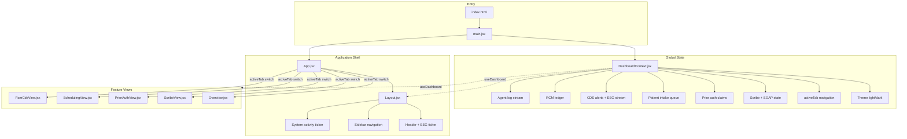
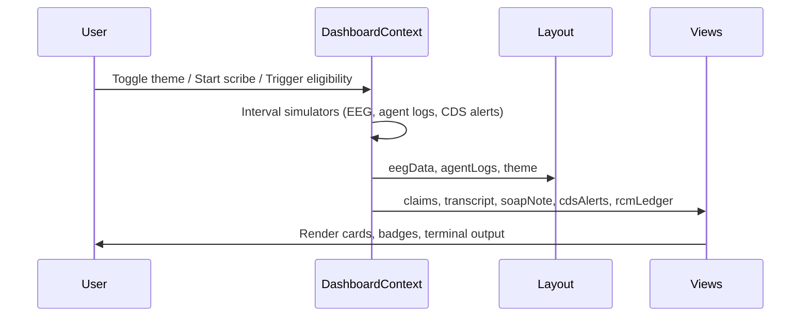

# Sage Clinical Agent 🌿

A clinical automation dashboard that simulates an autonomous healthcare agent for ambient scribing, prior authorization, patient intake, clinical decision support (CDS), and revenue cycle management (RCM).

Built as a single-page React application with live mock data streams, designed for high readability in both light and dark modes.

---

## Problem (Neurology Case Study Example)

Outpatient clinics face overlapping operational burdens that compete for physician attention:

| Challenge | Impact |
|-----------|--------|
| **Documentation load** | Physicians spend significant time on SOAP notes instead of patient care |
| **Prior authorization friction** | Neuroimaging (MRI/MRA), EEG, EMG/NCS, and specialty therapies require insurer portal navigation and clinical justification |
| **Intake & eligibility** | Front-desk staff manually verify coverage, copays, and appointment readiness |
| **CDS monitoring** | EEG, ICP, and seizure-risk signals need real-time visibility during encounters |
| **RCM leakage** | Denied claims and missing documentation delay reimbursement |

Legacy dashboards often use low-contrast dark themes, cardiology-centric telemetry (ECG/heart rate), and fragmented UIs that obscure clinical status text.

---

## Solution

**Sage Clinical Agent** unifies five clinical workflows into one readable dashboard for **Dr. Evelyn Young, Neurology Specialist**:

1. **Overview** — KPIs, quick-launch navigation, and live agent activity stream
2. **Ambient Scribe** — Simulated live transcript + editable SOAP note compiler
3. **Prior Auth Portal** — Claims pipeline with automation terminal (`SAGE_CLI_ENGINE`)
4. **Intake & Scheduling** — Patient queue with eligibility badges and intake analytics
5. **CDS Monitor & RCM** — Neurology CDS alerts (ICP, EEG) and billing ledger

The UI uses a **Sage & Earthy Neutral** design system with WCAG AA contrast, organic leaf/sprout status iconography, and an EEG brainwave ticker (replacing cardiology ECG).

---

## Architecture



### Data flow (simulated streams)



### Tech stack

| Layer | Technology |
|-------|------------|
| UI | React 19 |
| Build | Vite 8 |
| Styling | Tailwind CSS v4 (`@theme` tokens in `src/index.css`) |
| Icons | Lucide React |
| State | React Context (`DashboardContext.jsx`) |
| Lint | Oxlint |

### Project structure

```
agy-clinical-dashboard/
├── public/
│   └── favicon.svg          # Sage leaf icon
├── src/
│   ├── main.jsx             # App bootstrap + DashboardProvider
│   ├── App.jsx              # Tab router + app-content wrapper
│   ├── index.css            # Design tokens, dark-mode contrast, panel utilities
│   ├── context/
│   │   └── DashboardContext.jsx   # Mock data + live simulators
│   └── components/
│       ├── Layout.jsx       # Shell, header EEG ticker, sidebar, footer
│       ├── ThemeToggle.jsx
│       ├── Overview.jsx
│       ├── ScribeView.jsx
│       ├── PriorAuthView.jsx
│       ├── SchedulingView.jsx
│       └── RcmCdsView.jsx
├── implementation_plan_v3.md
├── implementation_plan_neurology.md
└── tasks.md
```

---

## Design system

### Light mode (default)

Sage green palette anchored on:

- `#647b6a`, `#869b8b`, `#a9baab`, `#9cb5ad`, `#91a596`
- Soft linen backgrounds (`#f7faf8`)

### Dark mode

Dark green surfaces bounded by:

- `#2e4738` (deepest background)
- `#6f8d77` (borders / accents)
- `#b8cbb8` (legacy accent)

Text on dark cards uses **crisp ivory** (`#F4F1EA`) and **white** headings for WCAG AA+ contrast.

### Status iconography

| Status | Icon |
|--------|------|
| Approved / Eligible / Paid | Green leaf |
| In Review / Pending / Submitted | Moss sprout |

---

## Setup

### Prerequisites

- **Node.js** 18+ (20+ recommended)
- **npm** 9+

### Install and run

```bash
# Clone the repository
git clone <your-repo-url>
cd agy-clinical-dashboard

# Install dependencies
npm install

# Start development server
npm run dev
```

Open the URL printed in the terminal (typically `http://localhost:5173`).

### Other commands

```bash
npm run build    # Production build → dist/
npm run preview  # Preview production build locally
npm run lint     # Run Oxlint
```

### Usage notes

- **Theme toggle**: Moon icon = dark mode active; Sun icon = light mode active
- **Navigation**: Use the sidebar to switch between the five clinical modules
- **Ambient Scribe**: Click *Start Ambient Session* on the Scribe view to stream mock dialogue into the SOAP editor
- **Prior Auth terminal**: Background `[Portal Agent]` logs auto-scroll in the right-hand panel
- **Intake**: Click *Verify* on pending patients to simulate eligibility checks

---

## Clinical persona (neurology)

| Element | Value |
|---------|-------|
| Application name | Sage Clinical Agent |
| Logged-in physician | Dr. Evelyn Young, Neurology Specialist |
| CDS stream | EEG brainwave simulation |
| Live metrics | `ICP: 11 mmHg · Alpha: Stable` |
| Sample CPT codes | 70551 (Brain MRI), 95816 (EEG), 95886 (EMG/NCS), 64615 (Botox migraine), 99214 (office visit) |

---

## Implementation documentation

Detailed change logs for major refactors:

- [`implementation_plan_v3.md`](implementation_plan_v3.md) — Sage color overhaul & rebranding
- [`implementation_plan_neurology.md`](implementation_plan_neurology.md) — Cardiology → neurology transition
- [`tasks.md`](tasks.md) — Project task ledger

---

## Limitations & future work

This is a **frontend prototype** with simulated data. There is no backend API, EHR integration, or real PHI handling.

Potential extensions:

- REST/WebSocket backend for live vitals and claim status
- Role-based access and audit logging
- FHIR-compatible patient data layer
- Automated accessibility testing in CI

---

## License

Private / submission use. Update this section if published under an open-source license.
